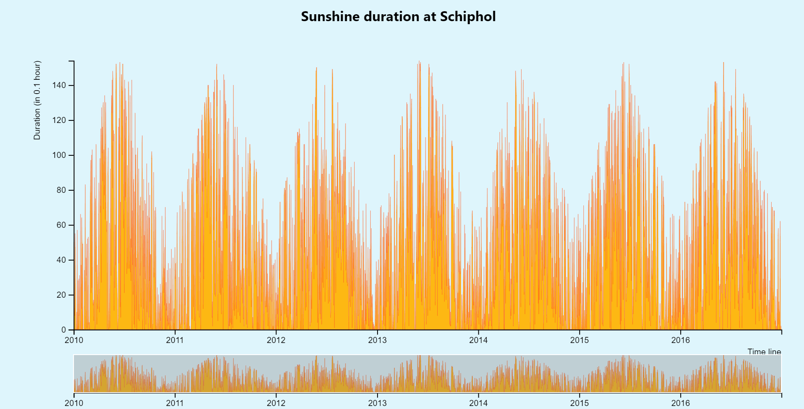

# Sunshine duration at Schiphol
This is a zoom & brush data visualization that I made for assessment 2 for the subject Front end 3. The code of this visualization was based on [Brush & Zoom](https://bl.ocks.org/mbostock/34f08d5e11952a80609169b7917d4172) by Mike Bostock (GNU v.3)

In this visualization you can see how much time in a day we had sun in Schiphol, The Netherlands. 



## Data
The data that I used for my graph is from the [KNMI](http://projects.knmi.nl/klimatologie/daggegevens/selectie.cgi). Here I selected the period from 2010/01/01 untill 2016/12/31, All the KNMI elements where selected and the station 240 Schiphol. 

The original data was "dirty data" in a `.txt` file. The file has: 
* An introduction text.
* An abbreviation explanation of the data.
* The data itself
    - Separated by commas and spaces. 

For my chart I used the following data:
* YYYYMMDD: Datum (YYYY=year MM=month DD=day); 
* SQ:  Sunshine duration (in 0.1 hour) 


* [`index.txt`]() - KONINKLIJK NEDERLANDS METEOROLOGISCH INSTITUUT (KNMI)
```tsv
# BRON: KONINKLIJK NEDERLANDS METEOROLOGISCH INSTITUUT (KNMI)
# Opmerking: door stationsverplaatsingen en veranderingen in waarneemmethodieken zijn deze tijdreeksen van dagwaarden mogelijk inhomogeen! Dat betekent dat deze reeks van gemeten waarden niet geschikt is voor trendanalyse. Voor studies naar klimaatverandering verwijzen we naar de gehomogeniseerde reeks maandtemperaturen van De Bilt <http://www.knmi.nl/kennis-en-datacentrum/achtergrond/gehomogeniseerde-reeks-maandtemperaturen-de-bilt> of de Centraal Nederland Temperatuur <http://www.knmi.nl/kennis-en-datacentrum/achtergrond/centraal-nederland-temperatuur-cnt>.
# 
# 
# STN      LON(east)   LAT(north)     ALT(m)  NAME
# 240:         4.790       52.318      -3.30  SCHIPHOL
...
 240,20100101,   28,   42,   46,   80,    3,    0,   21,  130,    4,  -16,  -63,   22,    8,   13,  -86,   24,   50,   64,  343,    0,   -1,   -1,    1,10030,10094,   24, 9985,    3,   60,    1,   80,   15,    3,   82,   95,   24,   69,   15,    3
  240,20100102,  186,   23,   43,   80,   24,   20,    1,  120,   23,   -6,  -55,    1,   16,   16,  -68,    6,    3,    4,  146,   20,    7,    5,   16,10136,10178,   24,10098,    1,   24,   16,   68,    3,    8,   95,   98,    9,   90,    3,    2
  240,20100103,   19,   14,   28,   80,    1,   10,   16,  120,    1,  -34,  -75,    8,   -5,   14,  -82,   24,   52,   66,  360,    0,    0,    0,    1,10221,10234,   19,10185,    1,   50,    8,   70,   13,    3,   91,   97,   20,   80,   14,    3
```
## Features

### D3
* [`d3-scale`](https://github.com/d3/d3-scale#api-reference)
* [`attr`](https://github.com/d3/d3-selection/blob/master/README.md#selection_attr) - create or change an attribute.
* [`append`](https://github.com/d3/d3-selection/blob/master/README.md#selection_append) - create or select new elements.
* [`domain`](https://github.com/d3/d3-scale/blob/master/README.md#continuous_domain) - give the input for a domain.
* [`range`](https://github.com/d3/d3-scale/blob/master/README.md#continuous_range) - set the range for a scale.
* [`d3-zoom`](https://github.com/d3/d3-zoom)
* [`d3.brush`](https://github.com/d3/d3-brush)

## Workflow
1. First I searched for a interesting data that I could work with it.
    - In the beginning I tried to work with multiple data sets from the cbs website. Un fornatually it didn't work that good for me. I spent too much time trying to clean it. I almost had cleaned the whole data but I got stuck when I had to remove one line text that was in the middle of my data. 
    - Because I had already spent a lot of time cleaning the data I chose to work with another data. So I decided to take a look in the data from the KNMI. I saw a lot of different possibilities of graphs that could work with this data and decided to work with it. 
2. After I downloaded the data and cleaned it. I took a lot in which data I found interesting to use. The data of the `sp`(Sunshine duration) column and the `DR` (Rainfall duration). And of course the date data. 
3. After I chose with which data I would work I tried to picture in my head what kind of graph I could display this data. 
    - The first thing that came to me was a bar chart and a scatter chart. 
    - I started coding my code like I was coding a bar chart but then I realized that I already had made I couple of bar charts in the last 3 weeks. So started thinking again for another kind of chart. 
    - I hadn't a lot of time left and that was bothering me, because it felt like it was restricting myself to challenge myself. 
    - After a lot of thinking and searching for ideas on the internet I had a inspiration to do a zoom and brush graph. My inspiration came from the [Brush & Zoom](https://bl.ocks.org/mbostock/34f08d5e11952a80609169b7917d4172) by Mike Bostock.
4. My following step was to link my cleaned data and the code from [Brush & Zoom](https://bl.ocks.org/mbostock/34f08d5e11952a80609169b7917d4172).
    - I did that in the first place to see if my cleaned data was working. 
    - When everything was working I played a little with his code to see if I understood everything it did.
5. Adding more features was my 5th step. I made a list of changes/features that I would like to make for the graph, like:
    - A nice visual with meaningful colors.
    - To add text to the x and y axis.
    - To add a tooltip that helps the visualization of the graph. 
    - To fix that the graph doesn't go outside the yaxis when scrolling. 
    - A button/ checkbox where I can change from `sunshine duration` to `rainfall duration`. 
    - A button/ checkbox where I can show both graphs in one. 
6. Writing a readme.md explaining my graph, data and workflow.  

### Changes made
#### HTML
* Gave it a basic HTML structure.
* Closed the `<body>` tag.
* Added a `h1`.

#### CSS
* Added a background color.
* Added a meaningful color to the chart.
    - I added a yellow and orange color to it that stands for the warmth. 
    ```
    .area {
        fill: #FDB813;
        stroke: #FF5721;
        stroke-width: .02em;
        clip-path: url(#clip);
    }
    ```

#### JS
* Cleaned the data file. 
    ```
    var header = doc.indexOf('STN,YYYYMMDD');
    var endHeader = doc.indexOf('\n', header);
    var parseTime = d3.timeParse('%Y%m%d')

    doc = doc.slice(endHeader);
    doc = doc.replace('#', '').trim();
    doc = doc.replace(/ +/g, '');
    ```
* Changed the `.scaleExtent([1, infinite])` to `.scaleExtent([1, 20])`
    - This means that the user can't zoom infinitely threw the chart. After 50 times zooming it stops. By this chart the maximum you can zoom is per day. 
    ```
    var zoom = d3.zoom()
    .scaleExtent([1, 50])
    .on('zoom', zoomed);
    ```
* Added text to the x and y axis.
    ```
    .append("text") // Add text 
    .attr("class", "label") // Add class element with the name of "label".
    .attr("transform", "rotate(-90)") // rotates element -90grades
    .attr("y", -40) // Set y position
    .style("text-anchor", "end") // Text end alignment
    .text("Duration (in 0.1 hour) ");
    ```

## Todo
- [ ] To add a tooltip that helps the visualization of the graph. 
- [ ] A button/ checkbox where I can change from `sunshine duration` to `rainfall duration`. 

## Links used for research
* [Brush & Zoom](https://bl.ocks.org/mbostock/34f08d5e11952a80609169b7917d4172) by Mike Bostock
* [Brush](https://cmda-fe3.github.io/course-17-18/class-4/brush/) by Titus Wormer
* [d3-brush](https://github.com/d3/d3-brush)
* [d3-zoom](https://github.com/d3/d3-zoom)
* [Enter, Update, Exit](https://medium.com/@c_behrens/enter-update-exit-6cafc6014c36)

## License
[GNU v.3](https://opensource.org/licenses/GPL-3.0) © Luisa Braga dos Santos
